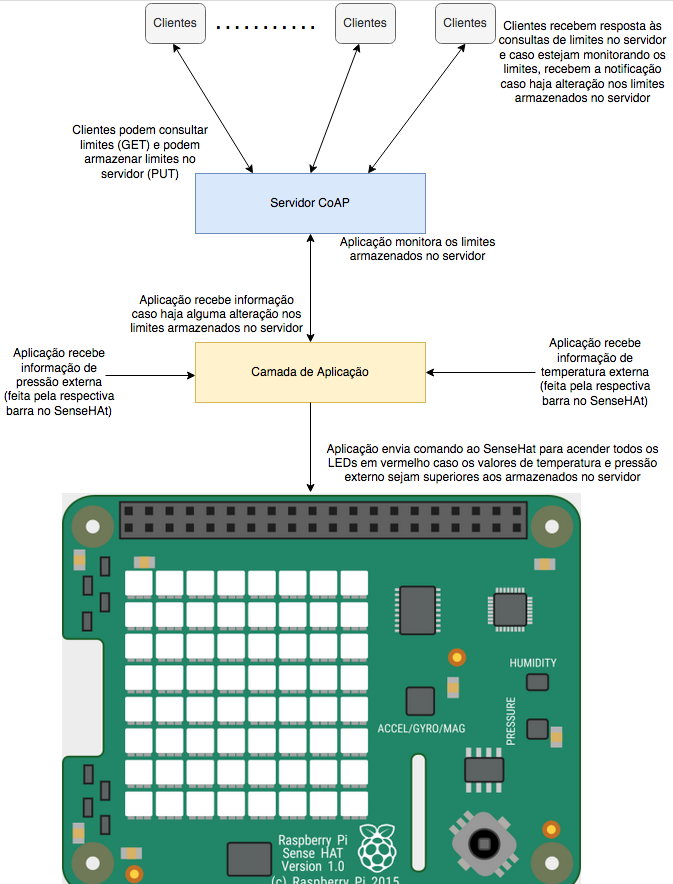

# CoAP_IoT



* O **Servidor CoAP** é resposável por disponibilizar os recursos aos clientes. Ao ser iniciado, o servidor diponibiliza o recurso "/sensor". Esse recurso armazena os limites de temperatura e pressão que são enviados pelos clientes por meio da operação PUT. O servidor também responde as consultas feitas pelos clientes sobre quais os valores limites estão armazeandos. Essa consulta é feita por meio da operação GET.

* A **Camada de Aplicação** monitora os valores limites de temperatura e pressão armazenados no servidor e também os valores externos aferidos pelo SenseHat por meio das respectivas barras de temperatura e pressão. Qualquer alteração feita nos limites armazeandos no servidor, é informada imediatamente à Camada de Aplicação. A Camada de Aplicação compara os valores armazenados no servidor com os valores externos aferidos pelo SenseHat. Caso os valores de temperatura e pressão do SenseHat sejam simultaneamente superiores aos valores armazenados no servidor, a Camada de Aplicação envia um comando para que todos os LEDs do SenseHat acendam na cor vermelha, caso contrário branco.

* O **Cliente CoAP** é capaz de:
	- Fazer consultas ao servidor para saber quais valores limites de temperatura e pressão estão armazenados no mesmo. Para isso faz-se uso da operação GET.
	- Armazenar no servidor limites de temperatura e pressão. Para isso faz-se uso da operação PUT.
	- Monitorar os limites de temperatura e pressão armazenados no servidor. Caso haja alguma alteração nos limites armazenados os mesmos são informados a todos os clientes que estão monitorando o servidor. Essa função é diponibilizada após o uso da operação PUT e tambem pode ser feita por meio da operação OBSERVE.

----------------------------------

# Instrução para a execução do código
## Requisitos:
*	PIP
*	Python 2.7
*	CoAPthon 4.0.2
*	SenseHat Emulator


1) Instalar o CoAPthon usando o comando pip:

	```sudo pip install CoAPthon```


2) Fazer download dos arquivos do Github para a pasta desejada.
Para isso abra o terminal na pasta desejada e execute o comando:

	```git clone https://github.com/danilofernassis/CoAP_IoT.git```

3) Apos download entrar no diretorio CoAP_IoT:

	```cd CoAP_IoT```

4) Iniciar o servidor no IP da maquina e na porta desejada, por exemplo, iniciando o servidor no IP 127.0.0.1 e porta 5683:

	```python servidor.py 127.0.0.1 5683```

5) Abrir outro terminal, entrar no diretorio entrar no diretorio CoAP_IoT e iniciar a Camada de Aplicação informando o IP e a porta na qual o servidor foi iniciado:

	```python camada2.py -p coap://127.0.0.1:5683/sensor```

6) Abrir outro terminal, entrar no diretorio CoAP_IoT. O cliente pode verificar qual são os limites armazenados no servidor por meio do comando GET, os valores armazenados são retornados no payload na ordem temperatura primeiro depois pressão:

	```python cliente.py -o GET -p coap://127.0.0.1:5683/sensor```

	O cliente também pode armazenar no servidor limites de temperatura e pressão desejados por meio do comando PUT. Por exemplo, caso deseje armazenar uma temperatura de 67ºC e uma pressão de 847mbar, então:(atenção a ordem: temperatura primeiro depois pressão entre aspas duplas)

	```python cliente.py -o PUT -p coap://127.0.0.1:5683/sensor -P "67 847"```

7) Ao executar o comando para armazenar valores no servidor, será perguntado se deseja "Continuar a monitorar limites no servidor? [y/N]: ". Caso outro cliente venha a alterar os valores armazenados no servidor, se o monitorando estiver ativo, os limites no servidor, ao serem alterados serão informados a todos que estão monitorando para que os mesmos possam parar o monitoramento e enviar novos valores ou continuarem a monitorar caso desejem. O monitoramento tambem pode ser ativado por meio da função OBSERVE:

	```python cliente.py -o OBSERVE -p coap://127.0.0.1:5683/sensor```

8) Movimentando-se as barras de temperatura e pressão no SenseHat, caso os valores aferidos pelas barras sejam simultaneamente superiores aos valores de temperatura e pressão armazenados no servidor, então a Camada de Aplicação envia comando ao SenseHat para acender todos os LEDs na cor vermelha, caso contrário branco.

[**Vídeo demonstrando a execução do CoAP**](https://youtu.be/pQ872p8E-9Y)
----------------------------------